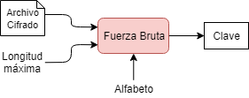
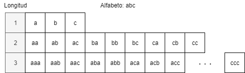

## Ataque de fuerza bruta



Pequeño script escrito en python, utilizado para comprobar conceptualemte como funcionan el ataque de fuerza bruta. Esta dirigido a archivos zip comprimidos en ZipCrypto.

Proporcionamos la ruta del archivo comprimido, la longitud máxima de las combinaciones de la claves y el alfabeto inicial.

### Uso
Llamada a `fuerzaBrutaZip.py` desde línea de comandos.

```shell
$ python3 src/fuerzaBrutaZip.py -c Comprimido.zip -l 5

Alfabeto: abcdefghijklmnopqrstuvwxyz
Longitud máxima: 5

Longitud 1 |■■■■■■■■■■■■■■■■■■■■■■■■■■■■■■■■■■■■■■■■| 100% Completado
Longitud 2 |■■■■■■■■■■■■■■■■■■■■■■■■■■■■■■■■■■■■■■■■| 100% Completado
Longitud 3 |■■■■■■■■■■■■■■■■■■■■■■■■■■■■■■■■■■■■■■■■| 100% Completado
Longitud 4 |■■■■■■■■■■■■■■■■■■■■■■■■■■■■■■■---------| 78% Completado

Tiempo transcurrido: 100.93152s
Clave: uemg
```

### Ayuda

```shell
$ python3 src/fuerzaBrutaZip.py -h
usage: fuerzaBruta.py [-h] -c COMPRIMIDO [-l LONGITUD] [-d DESTINO]

optional arguments:
  -h, --help            show this help message and exit
  -c COMPRIMIDO, --comprimido COMPRIMIDO
                        Archivo comprimido de entrada
  -l LONGITUD, --longitud LONGITUD
                        Longitud máxima de clave
  -d DESTINO, --destino DESTINO
                        Directorio del archivo extraído
```

### Algoritmo de generación
Producto cartesiano de vector de caracteres, iniciando con el alfabeto base. Es equivalente todas las posibles combinaciones del conjunto de caracteres con repetición.



### Modulos utilizados
- itertools
- argparse
- time
- zipfile

### Problemas
1. Eficiencia del algoritmo producto cartesiano
2. Uso de hilos
3. Eficiencia de descompresion de zipLib
4. ziplib funciona con ZipCrypto y no con AES-256 (compresión en 7zip)
